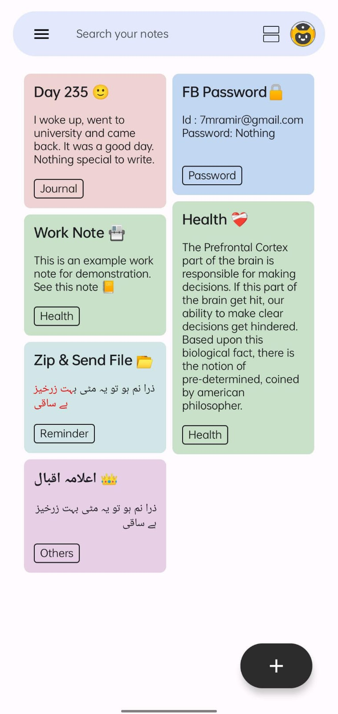

## AI Keep - Notes Taking App with RAG

The basic functionality of this app is quite similar to Google Keep App with two major additional features. The first one is rich text editing and the second one is using an AI assistant to respond to user's queries.

  

### Main Notes Screen 

  

### Assistant Screen 
I used the RAG (Retrieval Augmented Generation) technique to append the relevant notes with the user's query and then give it to LLM.

  

### Rich Text Editing Features
User can style the texts with a variety of options such as bold, highlight, italic, font size, etc.

  

